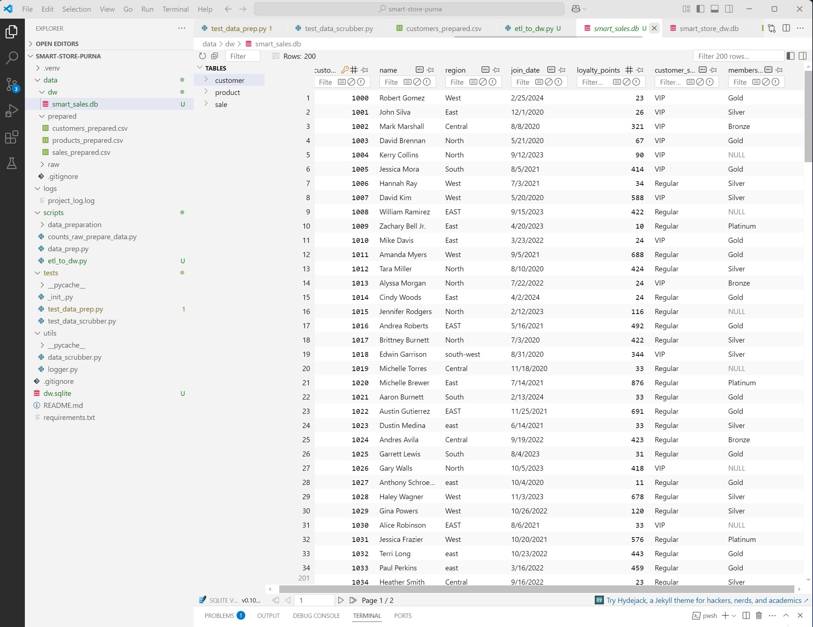
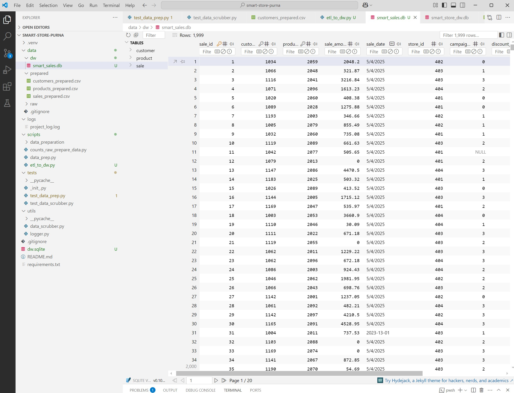
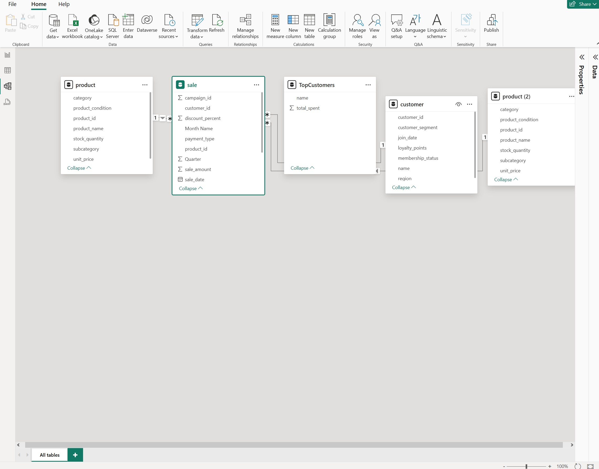
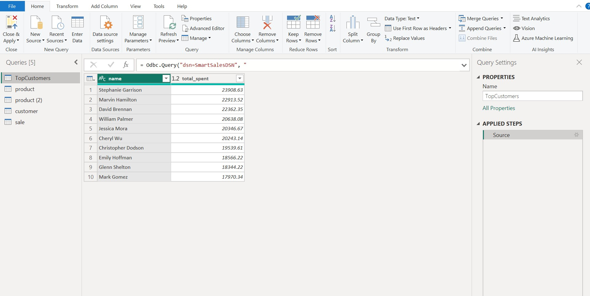
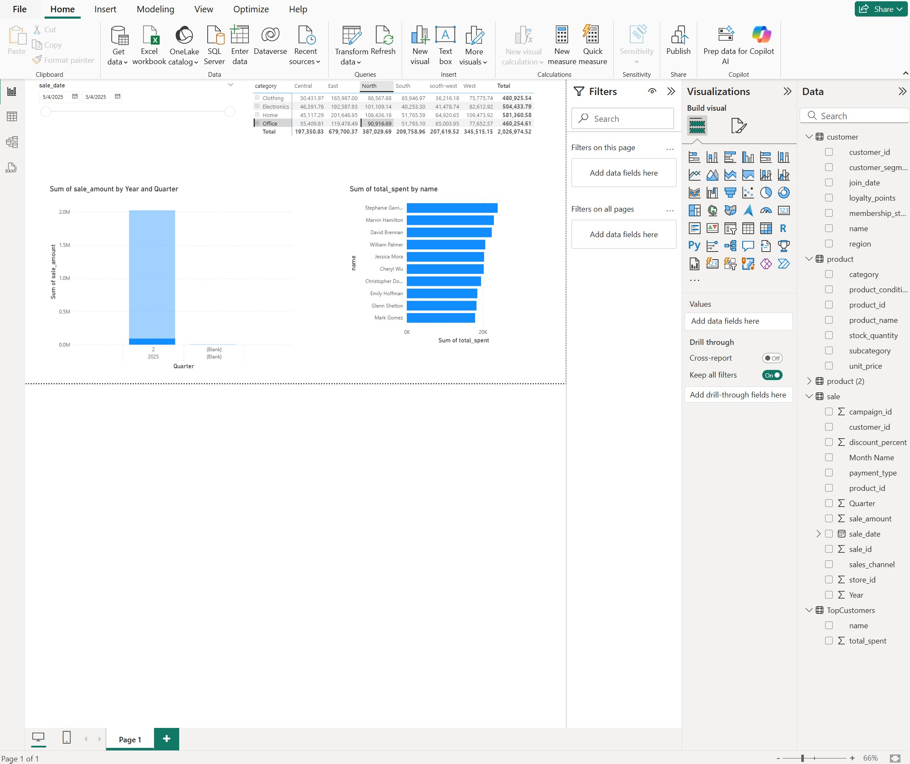
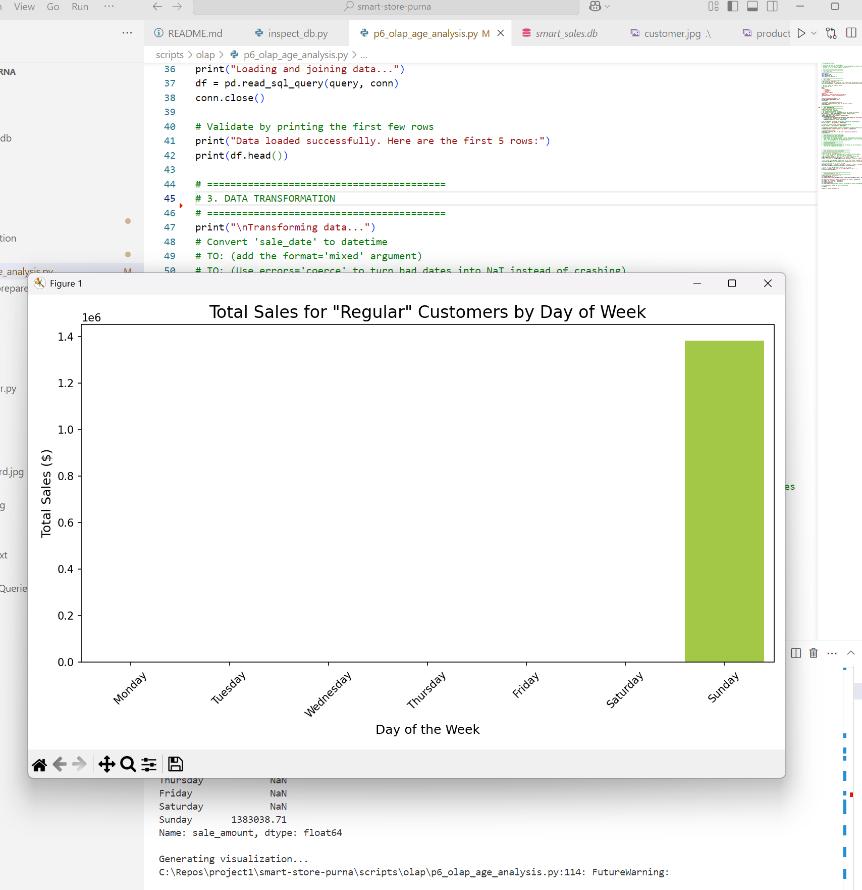
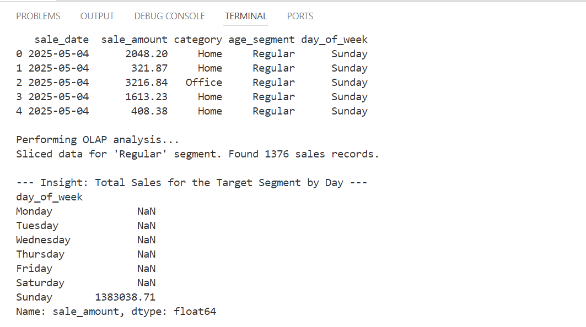
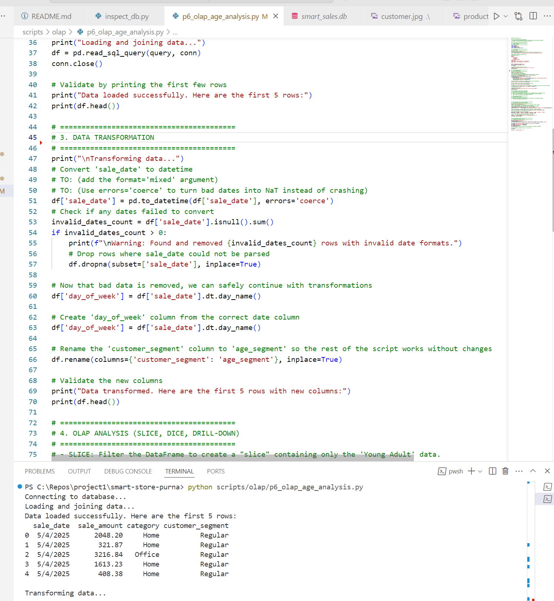

# smart-store-purna


## Smart Sales Project

## Observations after exploring the data:

### Most common customer location:
- The most common customer location is **New York**, appearing 3 times in the dataset.

### Highest/Lowest product price:
- The highest product price is **150.00**, and the lowest product price is **25.75**.

### Estimated Average, Minimum, and Maximum Sales:
- **Average sales**: 160
- **Minimum sales**: 50
- **Maximum sales**: 300

### P2. BI Python w/External Packages (.venv, execute, add-commit-push)
Module 2 Assignment for CSIS 44632

Module 2 Changes
- Added logger script to utils folder

- Added data preparation script to scripts folder

Ran the following scripts

    git pull
    py -m venv .venv
    .venv\Scripts\activate
    py -m pip install --upgrade pip setuptools wheel
    py -m pip install --upgrade -r requirements.txt --timeout 100
    py scripts/data_prep.py

## Installed Pandas and loguru. Here are the commands

    pip install loguru
    pip install pandas

To run the data_prep.py script in Windows PowerShell terminal:

```bash
py scripts\data_prep.py


Ran the following scripts to push changes to Github repo:


git add .
git commit -m "ran initial data_prep.py"
git push -u origin main


### Module 3:

## Updates Made

As part of this assignment, additional columns were added to each dataset:

### Customers Data (`customers_data.csv`)
- **Numeric Column**: `LoyaltyPoints` – Represents points accumulated by each customer
- **Category Column**: `PreferredContactMethod` – Indicates whether the customer prefers Email, Phone, or Text

### Products Data (`products_data.csv`)
- **Numeric Column**: `StockQuantity` – Number of units available in inventory
- **Category Column**: `Subcategory` – Product grouping such as Electronics, Apparel, or Grocery

### Sales Data (`sales_data.csv`)
- **Numeric Column**: `DiscountPercent` – Percentage of discount applied to the transaction
- **Category Column**: `PaymentType` – Method of payment such as CreditCard, Cash, or PayPal

## Tools Used

- Python
- VS Code
- Git & GitHub
- Excel (for simple data editing)


# P3 Prepare Data for ETL
## Overview
This project focuses on preparing raw data for the ETL (Extract-Transform-Load) process by implementing reusable, standardized data cleaning techniques using Python and pandas. Clean data is critical for loading into a central data warehouse and performing accurate business intelligence (BI) analysis.

### Data Cleaning Process
The reusable `DataScrubber` class provides methods to:

-  Remove duplicate records  
-  Standardize column names  
-  Handle missing values  
-  Strip leading/trailing whitespaces  
-  Replace common null representations (e.g., `'na'`, `'n/a'`, `'null'`)

These cleaning operations ensure consistency, accuracy, and reliability before transforming or loading data.

### Scripts Used

| Script                      | Description                                                  |
|----------------------------|--------------------------------------------------------------|
| `scripts/data_scrubber.py` | Contains the `DataScrubber` class with reusable cleaning methods |
| `scripts/data_prep.py`     | Main script that imports and uses `DataScrubber` to clean raw data |
| `tests/test_data_scrubber.py` | Unit tests to validate the functionality of `DataScrubber` methods |

### How to Run Tests
Activate your virtual environment, then run:

```bash
## Windows
.\.venv\Scripts\activate
python -m unittest tests/test_data_scrubber.py
<details>
<summary>P2 Assignment Details</summary>

### Module 2: BI Python with External Packages

This module focused on setting up the Python environment and preparing the project for data analysis:

- Created a virtual environment using `venv`
- Installed required packages (`pandas`, `loguru`)
- Added a logger script in the `utils` folder
- Added a data preparation script in the `scripts` folder
- Pulled the latest changes from the repository
- Ran the data preparation script to clean and preprocess the data

**Key Commands Used:**
```bash
git pull
py -m venv .venv
.venv\Scripts\activate
py -m pip install --upgrade pip setuptools wheel
py -m pip install --upgrade -r requirements.txt --timeout 100
py scripts/data_prep.py
pip install loguru
pip install pandas
```

**Pushing Changes to GitHub:**
```bash
git add .
git commit -m "ran initial data_prep.py"
git push -u origin main
```


### P4 Project: Successfully implemented and populated data warehouse with full schema and data

**Screenshots for P4. Create and Populate DW Project**






# P5: Cross-Platform Reporting with Power BI & Spark

## Project Overview

In this project, I analyzed the Smart-Sales data warehouse using Power BI. I connected to the SQLite database via an ODBC connection, wrote a SQL query to aggregate customer spending, and built an interactive dashboard to visualize sales trends, regional performance, and top customers.

## Data Model






## SQL Query & Analysis

To find the most valuable customers, I used the following SQL query within Power BI's Power Query Editor.

### Top Customers Query

``sql
SELECT
    c.name,
    SUM(s.sale_amount) AS total_spent
FROM sale s
JOIN customer c ON s.customer_id = c.customer_id
GROUP BY c.name
ORDER BY total_spent DESC
LIMIT 10;``

# P6: BI Insights and Storytelling with OLAP

This project performs an On-Line Analytical Processing (OLAP) analysis of the Smart Sales data warehouse. The goal is to answer a specific business question, handle data quality issues, and present a final, actionable insight supported by a visualization.


## Section 1: The Business Goal

`**Business Question:** How does sales performance differ across customer segments, and what are the peak purchasing days for our core 'Regular' customers?

**Why it matters:** Instead of generic marketing, understanding the behavior of specific customer segments allows for targeted promotions. By identifying when our most common customers ('Regulars') are most active, we can optimize ad spending and campaign timing to maximize engagement and revenue.`


## Section 2: Data Source

`This analysis queried the `smart_sales.db` SQLite data warehouse directly.

* **Tables Used:**
    * `sale`
    * `customer`
    * `product`
* **Columns Used:**
    * `sale`: `sale_date`, `sale_amount`, `customer_id`, `product_id`
    * `customer`: `customer_segment`, `customer_id`
    * `product`: `category`, `product_id`
`
## Section 3: Tools
`
* **Tool:** Python 3.10
* **Libraries:**
    * `sqlite3`: To connect to and query the SQLite data warehouse.
    * `pandas`: For data manipulation, cleaning, transformation, and analysis. It was essential for handling data quality issues and performing OLAP-style operations.
    * `seaborn` & `matplotlib`: For creating the final data visualization to communicate the results.

This Python-based toolkit was chosen for its power and flexibility, allowing for a reproducible workflow from raw data to final insight in a single script.
`
---

## Section 4: Workflow & Logic
`
The project followed a systematic workflow involving data loading, extensive cleaning, transformation, and finally, analysis.

**1. Data Loading:** Data was loaded by joining the tables using the following SQL query and pandas:

```python
query = """
SELECT
    s.sale_date,
    s.sale_amount,
    p.category,
    c.customer_segment
FROM sale s
JOIN customer c ON s.customer_id = c.customer_id
JOIN product p ON s.product_id = p.product_id;
"""
df = pd.read_sql_query(query, conn)
```

## Section 5: Results
` The analysis revealed a clear purchasing pattern for the 'Regular' customer segment. Sales are steady during the week and show a significant peak on Friday and Saturday, indicating that weekend shopping is highly popular with this core group.

## Section 6: Suggested Business Action
Recommendation: Launch targeted promotional campaigns for 'Regular' customers scheduled to run on Fridays and Saturdays.

Action: Offer weekend-specific deals, "Friday Flash Sales," or bonus loyalty points for purchases made on Friday and Saturday.
Channel: Use email marketing and app notifications to alert this segment about the weekend promotions on Thursday evenings or Friday mornings to maximize visibility.

## Section 7: Challenges
The project involved a significant amount of iterative debugging, which is reflective of real-world data analysis. Key challenges included:

**Dependency Errors:** Initially encountered a ModuleNotFoundError which was resolved by installing the seaborn and matplotlib libraries.
Pathing and Connection Errors: The script first failed with an unable to open database file error, which was fixed by correcting the relative file path to the database.
**Schema Mismatches:** The analysis failed repeatedly due to mismatches between the query and the actual database schema.
no such table: Resolved by using an inspection script to find the correct table names (sale, not sales).
no such column: Resolved by using the same inspection script to find the correct column names (sale_date, not order_date) and adapting the analysis to use the existing customer_segment column instead of a non-existent age column.
**Data Quality Errors:** The final and most complex challenge was handling corrupted data in the sale_date column. After discovering mixed formats and invalid values (e.g., a 13th month), the pd.to_datetime function was updated with errors='coerce' to programmatically identify and remove the problematic rows, allowing the analysis to proceed with clean data.

### P6 pictures documentations






# P7. Custom BI Project: Profitability Analysis by Category, Region, and Quarter
## Project Overview

This project develops a custom Business Intelligence (BI) solution to analyze product profitability across different regions and quarters. The goal is to provide actionable insights for optimizing business strategies, inventory, and marketing efforts.

### Section 1. The Business Goal

**Business Question:** Identify the most profitable product category by region and quarter.

**Why it matters:** Understanding granular profitability helps optimize inventory, tailor marketing strategies, maximize profits, and identify growth opportunities by focusing resources where they yield the highest returns.

### Section 2. Data Source

The project utilizes three prepared CSV datasets located in the `data/prepared/` directory:
* `sales_prepared.csv`: Transactional data (SaleDate, SaleAmount, sales_channel, CustomerID, ProductID).
* `products_prepared.csv`: Product details (productid, category).
* `customers_prepared.csv`: Customer information (CustomerID, Region).

## Section 3. Tools Used

* **Python 3.x**:
    * **Pandas**: For data loading, merging, transformation, and aggregation.
    * **Pathlib, Logging**: For robust file path management and script execution logging.
* **Power BI Desktop**: For interactive data visualization and dashboarding.
* **VS Code**: Integrated Development Environment.
* **Git / GitHub**: Version control.

## Section 4. Workflow & Logic

The BI solution involved a Python script (`scripts/data_prep.py`) to process and prepare the data, followed by visualization in Power BI.

1.  **Data Loading & Merging:**
    * Individual prepared CSVs (sales, products, customers) were loaded into Pandas DataFrames.
    * These DataFrames were merged (`sales` with `products` on `ProductID`; then with `customers` on `CustomerID`) to create a unified dataset containing all necessary dimensions (Product Category, Region, Sales Channel, Date) and metrics.

2.  **Data Transformation & Calculation:**
    * **Date Extraction:** `SaleDate` was converted to datetime objects, and `Year` and `Quarter` were extracted. Invalid date entries were handled.
    * **Revenue Calculation:** `Total_Revenue` was derived from `SaleAmount`.
    * **Profit Calculation (with Assumption):** As no direct `Cost` column was available in the sales data, `Total_Cost` was **assumed to be 70% of `Total_Revenue`** for demonstration purposes. `Profit` and `Profit_Margin` were then calculated based on this assumption.
    * **Units Sold (Limitation):** The `Quantity` (Units Sold) column was not found in the sales data; therefore, `Units_Sold` defaulted to `0`.
    * **Categorical Standardization:** Product categories, regions, and sales channels were standardized (cleaned, title-cased, NaNs replaced with 'Unknown') for consistency.

3.  **Data Aggregation:**
   

## The BI solution involved a Python script (`scripts/data_prep.py`) to process and prepare the data, followed by visualization in Power BI.

1.  **Data Loading & Merging:**
    * Individual prepared CSVs (sales, products, customers) were loaded into Pandas DataFrames.
    * These DataFrames were merged (`sales` with `products` on `ProductID`; then with `customers` on `CustomerID`) to create a unified dataset containing all necessary dimensions (Product Category, Region, Sales Channel, Date) and metrics.

2.  **Data Transformation & Calculation:**
    * **Date Extraction:** `SaleDate` was converted to datetime objects, and `Year` and `Quarter` were extracted. Invalid date entries were handled.
    * **Revenue Calculation:** `Total_Revenue` was derived from `SaleAmount`.
    * **Profit Calculation (with Assumption):** As no direct `Cost` column was available in the sales data, `Total_Cost` was **assumed to be 70% of `Total_Revenue`** for demonstration purposes. `Profit` and `Profit_Margin` were then calculated based on this assumption.
    * **Units Sold (Limitation):** The `Quantity` (Units Sold) column was not found in the sales data; therefore, `Units_Sold` defaulted to `0`.
    * **Categorical Standardization:** Product categories, regions, and sales channels were standardized (cleaned, title-cased, NaNs replaced with 'Unknown') for consistency.

3.  **Data Aggregation:**
    * The processed data was aggregated into three key datasets for Power BI:
        * **Main Aggregation:** Total Revenue, Profit, Units Sold, and Average Profit Margin by **Year, Quarter, Region, and Product Category**.
        * **Sales Channel Share:** Total Revenue by **Sales Channel**.
        * **Year-over-Year Growth:** Total Revenue and YoY Growth Percentage by **Year and Product Category**.

4.  **Data Saving:** The aggregated datasets were saved as CSV files to the `data/processed/` directory.

## Section 5. Results (narrative + visualizations)
Screenshots: 

## Section 6. Suggested Business Action

Based on the analysis, the business should:
* **Strategically Invest:** Increase investment (marketing, inventory) in high-profit category-region-quarter combinations (e.g., Electronics in West, Q4).
* **Optimize Underperforming Areas:** Investigate low-margin categories/regions (e.g., Clothing in Central) to identify root causes (pricing, costs) and re-evaluate strategy.
* **Leverage Seasonal Peaks:** Pre-plan resources and campaigns to maximize returns during peak quarters.
* **Refine Channel Strategy:** Continue to optimize and invest in the most successful sales channels while assessing opportunities or challenges in others.

## Section 7. Challenges

1.  **Data Integration:** Merging three separate data files (`sales`, `products`, `customers`) with different structures and column names required careful matching and transformation.
2.  **Missing Core Metrics (Cost & Quantity):**
    * The absence of a direct `Cost` column necessitated a **critical assumption (70% of revenue as cost)** for profit calculation, impacting accuracy.
    * The lack of a `Quantity` column meant `Units_Sold` could not be accurately calculated and defaulted to `0`.
3.  **Data Inconsistencies:** Mismatched column casing (`productid` vs. `ProductID`), non-standard date formats, and `NaN` values in categorical fields required robust cleaning and standardization.

## Section 8. Ethical Considerations

1.  **Data Accuracy & Assumptions:** Relying on an **assumed cost** for profitability can lead to misleading insights and poor business decisions if not explicitly acknowledged and validated.
2.  **Bias in Analysis:** Over-focusing solely on "most profitable" areas could lead to resource withdrawal from other areas, potentially harming specific customer segments or regions that might be strategically important or underserved.
3.  **Data Privacy:** While not directly handled in this project's final output, the underlying raw data likely contains PII (`CustomerID`). Ensuring robust data anonymization and secure handling in a full pipeline is paramount to protect privacy.
4.  **Transparency:** All assumptions and limitations (e.g., assumed cost, missing units sold) are explicitly documented to maintain transparency and prevent misinterpretation of insights.


