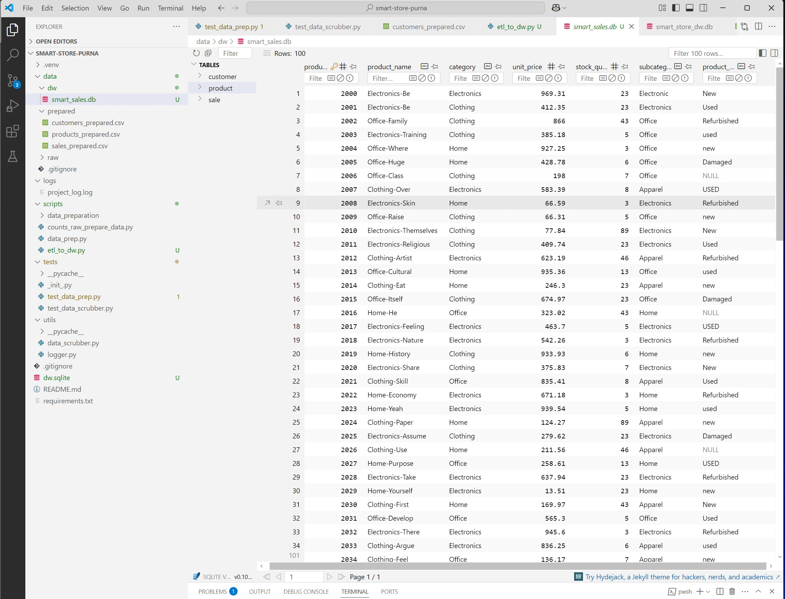

# smart-store-purna


## Smart Sales Project

## Observations after exploring the data:

### Most common customer location:
- The most common customer location is **New York**, appearing 3 times in the dataset.

### Highest/Lowest product price:
- The highest product price is **150.00**, and the lowest product price is **25.75**.

### Estimated Average, Minimum, and Maximum Sales:
- **Average sales**: 160
- **Minimum sales**: 50
- **Maximum sales**: 300

### P2. BI Python w/External Packages (.venv, execute, add-commit-push)
Module 2 Assignment for CSIS 44632

Module 2 Changes
- Added logger script to utils folder

- Added data preparation script to scripts folder

Ran the following scripts

    git pull
    py -m venv .venv
    .venv\Scripts\activate
    py -m pip install --upgrade pip setuptools wheel
    py -m pip install --upgrade -r requirements.txt --timeout 100
    py scripts/data_prep.py

## Installed Pandas and loguru. Here are the commands

    pip install loguru
    pip install pandas

To run the data_prep.py script in Windows PowerShell terminal:

```bash
py scripts\data_prep.py


Ran the following scripts to push changes to Github repo:


git add .
git commit -m "ran initial data_prep.py"
git push -u origin main


### Module 3:

## Updates Made

As part of this assignment, additional columns were added to each dataset:

### Customers Data (`customers_data.csv`)
- **Numeric Column**: `LoyaltyPoints` – Represents points accumulated by each customer
- **Category Column**: `PreferredContactMethod` – Indicates whether the customer prefers Email, Phone, or Text

### Products Data (`products_data.csv`)
- **Numeric Column**: `StockQuantity` – Number of units available in inventory
- **Category Column**: `Subcategory` – Product grouping such as Electronics, Apparel, or Grocery

### Sales Data (`sales_data.csv`)
- **Numeric Column**: `DiscountPercent` – Percentage of discount applied to the transaction
- **Category Column**: `PaymentType` – Method of payment such as CreditCard, Cash, or PayPal

## Tools Used

- Python
- VS Code
- Git & GitHub
- Excel (for simple data editing)


# P3 Prepare Data for ETL
## Overview
This project focuses on preparing raw data for the ETL (Extract-Transform-Load) process by implementing reusable, standardized data cleaning techniques using Python and pandas. Clean data is critical for loading into a central data warehouse and performing accurate business intelligence (BI) analysis.

### Data Cleaning Process
The reusable `DataScrubber` class provides methods to:

-  Remove duplicate records  
-  Standardize column names  
-  Handle missing values  
-  Strip leading/trailing whitespaces  
-  Replace common null representations (e.g., `'na'`, `'n/a'`, `'null'`)

These cleaning operations ensure consistency, accuracy, and reliability before transforming or loading data.

### Scripts Used

| Script                      | Description                                                  |
|----------------------------|--------------------------------------------------------------|
| `scripts/data_scrubber.py` | Contains the `DataScrubber` class with reusable cleaning methods |
| `scripts/data_prep.py`     | Main script that imports and uses `DataScrubber` to clean raw data |
| `tests/test_data_scrubber.py` | Unit tests to validate the functionality of `DataScrubber` methods |

### How to Run Tests
Activate your virtual environment, then run:

```bash
## Windows
.\.venv\Scripts\activate
python -m unittest tests/test_data_scrubber.py
<details>
<summary>P2 Assignment Details</summary>

### Module 2: BI Python with External Packages

This module focused on setting up the Python environment and preparing the project for data analysis:

- Created a virtual environment using `venv`
- Installed required packages (`pandas`, `loguru`)
- Added a logger script in the `utils` folder
- Added a data preparation script in the `scripts` folder
- Pulled the latest changes from the repository
- Ran the data preparation script to clean and preprocess the data

**Key Commands Used:**
```bash
git pull
py -m venv .venv
.venv\Scripts\activate
py -m pip install --upgrade pip setuptools wheel
py -m pip install --upgrade -r requirements.txt --timeout 100
py scripts/data_prep.py
pip install loguru
pip install pandas
```

**Pushing Changes to GitHub:**
```bash
git add .
git commit -m "ran initial data_prep.py"
git push -u origin main
```


### P4 Project: Successfully implemented and populated data warehouse with full schema and data

**Screenshots for P4. Create and Populate DW Project**





# P5: Cross-Platform Reporting with Power BI & Spark

## Project Overview

In this project, I analyzed the Smart-Sales data warehouse using Power BI. I connected to the SQLite database via an ODBC connection, wrote a SQL query to aggregate customer spending, and built an interactive dashboard to visualize sales trends, regional performance, and top customers.

## Data Model


## SQL Query & Analysis

To find the most valuable customers, I used the following SQL query within Power BI's Power Query Editor.

### Top Customers Query

``sql
SELECT
    c.name,
    SUM(s.sale_amount) AS total_spent
FROM sale s
JOIN customer c ON s.customer_id = c.customer_id
GROUP BY c.name
ORDER BY total_spent DESC
LIMIT 10;``

# P6: BI Insights and Storytelling with OLAP

This project performs an On-Line Analytical Processing (OLAP) analysis of the Smart Sales data warehouse. The goal is to answer a specific business question, handle data quality issues, and present a final, actionable insight supported by a visualization.


## Section 1: The Business Goal

`**Business Question:** How does sales performance differ across customer segments, and what are the peak purchasing days for our core 'Regular' customers?

**Why it matters:** Instead of generic marketing, understanding the behavior of specific customer segments allows for targeted promotions. By identifying when our most common customers ('Regulars') are most active, we can optimize ad spending and campaign timing to maximize engagement and revenue.`


## Section 2: Data Source

`This analysis queried the `smart_sales.db` SQLite data warehouse directly.

* **Tables Used:**
    * `sale`
    * `customer`
    * `product`
* **Columns Used:**
    * `sale`: `sale_date`, `sale_amount`, `customer_id`, `product_id`
    * `customer`: `customer_segment`, `customer_id`
    * `product`: `category`, `product_id`
`
## Section 3: Tools
`
* **Tool:** Python 3.10
* **Libraries:**
    * `sqlite3`: To connect to and query the SQLite data warehouse.
    * `pandas`: For data manipulation, cleaning, transformation, and analysis. It was essential for handling data quality issues and performing OLAP-style operations.
    * `seaborn` & `matplotlib`: For creating the final data visualization to communicate the results.

This Python-based toolkit was chosen for its power and flexibility, allowing for a reproducible workflow from raw data to final insight in a single script.
`
---

## Section 4: Workflow & Logic
`
The project followed a systematic workflow involving data loading, extensive cleaning, transformation, and finally, analysis.

**1. Data Loading:** Data was loaded by joining the `sale`, `customer`, and `product` tables using the following SQL query:
````python
# Corrected SQL Query
query = """
SELECT
    s.sale_date,
    s.sale_amount,
    p.category,
    c.customer_segment
FROM sale s
JOIN customer c ON s.customer_id = c.customer_id
JOIN product p ON s.product_id = p.product_id;
"""
df = pd.read_sql_query(query, conn)


